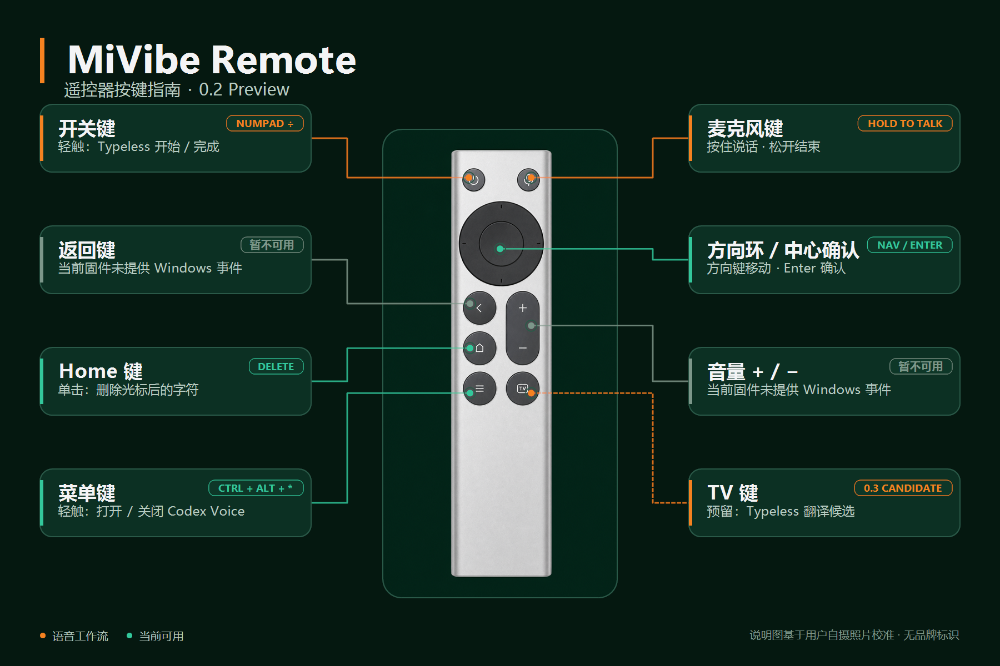

# MiVibe Remote

[English](README.md) | 简体中文

把小米蓝牙语音遥控器变成 Windows 11 上控制 Typeless 与 Codex Voice 的实体语音入口。



> **0.2 硬件预览版。** 当前版本仅在一台小米蓝牙语音遥控器 2 Pro（`VID 2717 / PID 32B8`）上完成验证，不是通用蓝牙遥控器驱动。

## 功能

- 通过 VB-CABLE 将遥控器麦克风音频送入 Windows。
- 用遥控器开关键开始或结束 Typeless 输入。
- 用菜单键触发 Codex Voice 快捷键。
- 在托盘窗口查看连接状态和遥控器电量。
- 语音桥意外断开后自动尝试重连。
- 可选择登录后自动启动，并检查 VB-CABLE 默认输入与当前 Windows 输出；可以识别 AirPods 配置，但 AirPods 不是必需设备。MiVibe 不会自动切换系统音频设备。

## 使用要求

- Windows 11 x64 24H2 或更高版本。
- 电脑支持 Bluetooth Low Energy（低功耗蓝牙）。电脑不需要 Type-C 接口；遥控器的 Type-C 只用于充电。
- 已在 Windows 中配对、设备名为 `小米蓝牙语音遥控器` 或 `MI RC` 的遥控器。当前只保证上述 `VID 2717 / PID 32B8` 实机配置可用；设备名称相同不代表其他批次一定兼容。
- 另行安装 [VB-CABLE](https://vb-audio.com/Cable/)。
- 已安装并登录 Typeless 和/或 Codex。

## 快速开始

1. 从 [Releases](https://github.com/Fanatical-Naturalist/MiVibe-Remote/releases) 下载最新的 **Setup EXE**。安装程序会请求管理员权限，并安装到 Program Files 供本机所有用户使用；请保留 **Remote Key Mapping**（遥控器按键映射）选项。
2. 在 Windows 蓝牙设置中配对遥控器，然后安装 VB-CABLE。
3. 将 **CABLE Output** 同时设为“默认录音设备”和“默认通信录音设备”。
4. 重启 Windows。如使用 Typeless，请在“设置 → 键盘快捷键 → 语音输入”中添加 `Numpad Divide`；映射生效后可直接轻触遥控器开关键录入，不要求电脑配有实体数字小键盘。
5. 如使用 Codex，请在“设置 → 语音聊天热键”中录入 `Ctrl + Alt + Shift + 8`；Codex 可能会将它显示为 `Ctrl + Alt + *`。启动 MiVibe Remote 后，可在托盘窗口开启“登录 Windows 后自动启动”。

如果安装时取消了按键映射，可从开始菜单运行 **MiVibe Remote → Enable Remote Key Mapping**，然后重启 Windows。需要核对安装包时，请下载同一 Release 中的 `SHA256SUMS.txt`，并用 PowerShell 的 `Get-FileHash` 比较 SHA-256。

## 按键

| 遥控器按键 | 当前功能 |
| --- | --- |
| 轻触开关键 | 开始或结束一次 Typeless 输入 |
| 按住麦克风键 | 按住说话；松开结束当前语音段 |
| 方向环 / 中心键 | 导航 / Enter |
| Home | 删除光标后的一个字符 |
| 菜单键 | 触发 Codex Voice 快捷键 |
| TV | 保留原始输入，MiVibe 不处理 |
| 返回 / 音量 | 当前 Windows 用户态方案无法读取 |

## 重要限制

- 必需的扫描码映射作用于整个系统：启用后，所有实体键盘的 `F5` 都会变为 `F13`；任何发出扫描码 `E0 5E` 的按键（通常是 Power）都会变为 `Numpad Divide`。
- 语音桥运行时，MiVibe 还会拦截电脑实体键盘上的 `Menu/Application` 和 `Home`。点击托盘窗口中的“暂停语音桥”或“安全退出”后会恢复原行为。
- 在已测试的遥控器上，连续按住麦克风约 60 秒后可能停止。可在同一次 Typeless 会话内松开后再次按住，继续输入。
- 当前 Codex Voice 快捷键与键盘布局有关。如果菜单键没有打开 Voice，请先在电脑键盘上测试 `Ctrl + Alt + Shift + 8`。
- VB-CABLE、Typeless 和 Codex 均为第三方产品，不随 MiVibe 一起分发。
- 当前安装包尚未进行代码签名，Windows SmartScreen 可能提示“未知发布者”。运行前请核对 Release 中公布的 SHA-256 校验值。
- 卸载程序只会删除与 MiVibe 完全一致的按键映射，并可能要求重启 Windows；不会改动其他软件或用户已有的映射。

## 卸载

1. 在 MiVibe 托盘窗口中点击“安全退出”。
2. 打开“Windows 设置 → 应用 → 已安装的应用”，卸载 **MiVibe Remote**，并批准管理员权限。
3. 如果卸载程序提示重启，请重启 Windows，使实体键盘映射恢复生效。VB-CABLE、Typeless、Codex 和蓝牙配对不会被删除。

更完整的安装与卸载说明见英文版 [Quick Start](docs/QUICK_START.md)。

## 从源码构建

```powershell
dotnet build src/MiVibe.Remote.Tray/MiVibe.Remote.Tray.csproj --configuration Release
```

制作 Release 安装包需要当前的 .NET 9 SDK 和 Inno Setup。贡献者说明见 [Development](docs/DEVELOPMENT_PLAN.md)，历史硬件与协议实验保留在 `docs/` 目录中。

## 许可证

MiVibe Remote 使用 [MIT License](LICENSE)。第三方组件继续适用各自的许可证，详见 [Third-Party Notices](THIRD-PARTY-NOTICES.md)。
